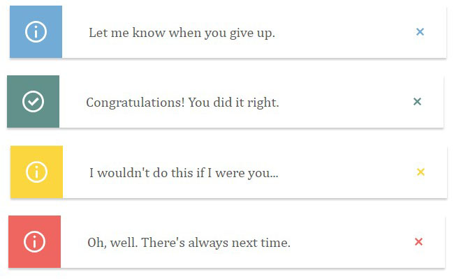

# Noti-react
[](https://badge.fury.io/js/noti-react)
[](https://github.com/odudek/noti-react)
[](https://www.npmjs.com/package/noti-react)
[](https://github.com/ODudek/noti-react)

Simple notification component for React with support for Typescript!



## Install

1. Use npm 
```bash
npm install noti-react
```
2. Use yarn
```bash
yarn add noti-react
```

## Notification

|property| propType|required|default|description|
|---|---|---|---|---|
|type|string ('error', 'info', 'success', 'warn')|- |'info'|Deside which type of notification do you want to use!|
|label|string|yes|-|Text which you want to display|
|autoHide|bool|-|true|Auto hide notification|
|animationTime|number|-|500|Time of animation duration in miliseconds|
|position|string ('top-left', 'top-right', 'bottom-left', 'bottom-right')|-|'bottom-right'| Position in which corner do you want to display notification|
|hideTime|number|-|5000|After this time notification will close if `autoHide` props is `true`|
|customColor|string (rgb string like '#000000') |-|-|Add your custom color|
|className|string|-|-|Customize style by adding custom class|

## Example

1. Import notification component
```javascript
import { Notification } from 'noti-react';
```
2. Use it in your component
```javascript
<Notification
    label="Example of notification"
/>
```

## Tests

Run tests
```bash
npm test
```
